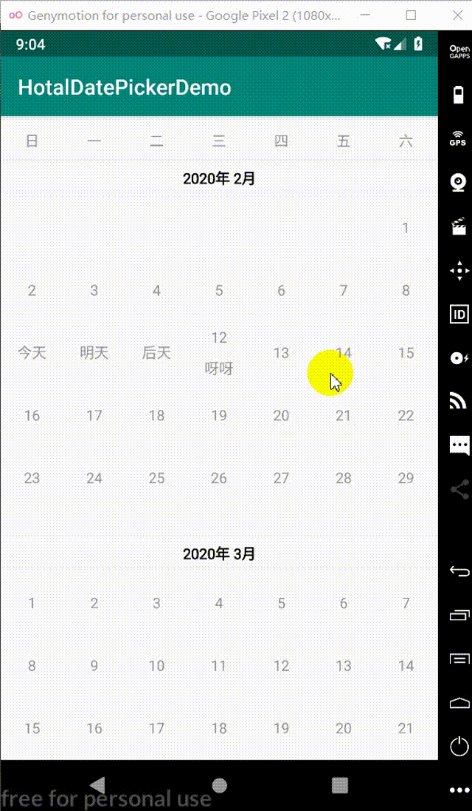

# hotaldatepicker
an android hotal datepicker

### 效果



### 引用

```groovy
//androidX 
implementation 'com.dreamlin.hotaldatepicker:hotaldatepicker:1.0.3'
implementation 'androidx.recyclerview:recyclerview-selection:1.1.0-rc01'
//非AndroidX
implementation 'com.dreamlin.hotaldatepicker:hotaldatepicker:0.0.4'
implementation 'com.android.support:recyclerview-v7:28.0.0'
```

### 属性

| 属性                 | 说明                                                         |
| -------------------- | ------------------------------------------------------------ |
| autoMeasure          | 是否自动测量宽度高度，默认为true                             |
| canSelectBeforeDay   | 今天之前的日期是否可选，默认为false不可选                    |
| itemWidth            | 日期格子宽度，不开启自动测量指定具体宽度 才有效（autoMeasure = false） |
| itemHeight           | 日期格子高度，不开启自动测量指定具体高度度 有效（autoMeasure = false） |
| monthAndYearTextSize | 年月标题字体大小，单位sp                                     |
| dateTextSize         | 日期字体大小，单位sp                                         |
| tipsTextSize         | 提示字体大小，单位sp                                         |
| lineColor            | 线的颜色                                                     |
| montAndYearTextColor | 年月标题字体颜色                                             |
| dateNormalBgColor    | 正常日期背景色                                               |
| dateSelectBgColor    | 选中日期背景色                                               |
| dateNormalTextColor  | 未选中的日期字体颜色                                         |
| dateSelectTextColor  | 选中的日期字体颜色                                           |
| invalidBgColor       | 无效日期的背景颜色                                           |
| invalidTextColor     | 无效日期的字体颜色                                           |
| tipsTextColor        | 提示字体颜色                                                 |
| tipsBgColor          | 提示字体背景色                                               |
| startBg              | 单选一个日期的背景drawable                                   |
| startBgOnly          | 多选日期后，选中的第一个日期的背景drawable                   |
| endBg                | 多选日期后，选中的最后一个日期的背景drawable                 |


### 其他可选项

| DateModel      | 属性说明                                      |
| -------------- | --------------------------------------------- |
| startYear      | 开始年份，默认是当前年                        |
| startMonth     | 开始月份，默认是当前月                        |
| monthCount     | 显示几个月，默认12个月                        |
| mostSelectNum  | 最多可以选择多少天，默认100天                 |
| leastSelectNum | 至少需要选择多少天，默认2天                   |
| defTag         | 默认标签，默认为空                            |
| beginTag       | 第一个选择日期的标签，默认为 `入住`           |
| endTag         | 最后一个选择日期的标签，默认为 `退房`         |
| invalidTips    | 选择包含无效日期时的提示，默认为 包含无效日期 |
| selectDays     | 选中的日期                                    |
| invalidDays    | 无效的日期                                    |
| tags           | 标签列表                                      |

### 使用

#### xml添加布局

```xml
<com.dreamlin.hotaldatepicker.DatePickerView
    android:id="@+id/date_wrapper"
    android:layout_width="match_parent"
    android:layout_height="wrap_content"
    app:autoMeasure="true"
    app:canSelectBeforeDay="false"
    app:dateNormalBgColor="#FFFFFF" />
```

#### 做一些预设

```java
List<PickerDay> invalidDays = new ArrayList<>();
List<PickerDay> tags = new ArrayList<>();
invalidDays.add(new PickerDay(2020, 2, 22));
tags.add(new PickerDay(2020, 2, 12, "呀呀"));
DatePickerAdapter.DateModel dateModel = new DatePickerAdapter.DateModel();
//        dateModel.beginTag = "";
//        dateModel.endTag = "";
dateModel.monthCount = 12;
dateModel.mostSelectNum = 10;
dateModel.invalidTips = "包含无效日期";
dateModel.invalidDays = invalidDays;
dateModel.tags = tags;
//        dateModel.defTag = "￥148";

dateView.setParams(dateModel, new DatePickListener() {
    @Override
    public void onFirstSelected(PickerDay pickerDay) {
        System.out.println("MainActivity.onFirstSelected");
    }

    @Override
    public void onRangeSelected(PickerDay first, PickerDay last) {
        System.out.println("MainActivity.onRangeSelected");
    }

    @Override
    public void onFirstSelectCancel(PickerDay pickerDay) {
        System.out.println("MainActivity.onFirstSelectCancel");
    }
});
```

### 自定义效果

支持自定义第一个及最后一个选择的效果，对应修改`startBg`、`endBg`为自定义Drawable资源即可， 为了美观考虑，建议同时将`dateSelectBgColor`颜色修改为和startBg一致，具体可参考Demo做法。

### 最后

欢迎`Issues` & `Star`呀！！

